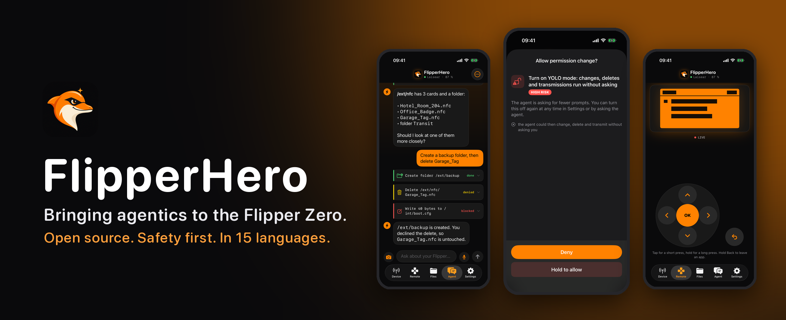

  

  <b>Open-source tools that make the Flipper Zero smarter, safer and more fun.</b> 
  An AI agent for your Flipper on your iPhone, and the pixels to go with it.

---

## 🛠️ Projects

<table>
<tr>
<td width="50%" valign="top">

### [📱 ios-app](https://github.com/flipper-hero/ios-app)

**Talk to your Flipper Zero.** An iPhone app that connects over Bluetooth and lets an AI agent
read, organise, transmit and emulate on your own device, and asks before it does anything that
matters.

- Agent chat with any OpenRouter model, voice and camera
- Live screen mirror and remote control
- Firmware updates over Bluetooth
- Siri, Shortcuts and Live Activities
- Risk checks in code, hold-to-approve for physical actions
- 15 languages

`Swift` · `SwiftUI` · `iOS 17+` · `MIT`

</td>
<td width="50%" valign="top">

### [📟 phrack-theme](https://github.com/flipper-hero/phrack-theme)

**Underground history, 128 × 64 pixels.** Three animated screens inspired by
[Phrack](https://phrack.org): terminal lettering, moving scanlines and a shared glitch rhythm.

Asset pack for Momentum and RogueMaster, plus a classic dolphin layout for Unleashed and official
firmware.

`Python` · `Pixel art` · `CC0 artwork`

</td>
</tr>
</table>

## 🧭 What we care about

| | |
|---|---|
| 🛡️ **Safety in code, not in prompts** | Whether an action needs your approval is decided by code that the model cannot talk its way around. Content from the device or the internet is treated as untrusted. |
| 🔓 **Open by default** | MIT-licensed code, CC0 artwork, reproducible asset packs and tests you can run without hardware. |
| 🌍 **For everyone** | Fifteen languages, including the safety prompts, because a warning you cannot read protects nobody. |
| 🐬 **Your device, your rules** | Tools for the Flipper you own and the systems you are allowed to test. |

## 🤝 Get involved

- ⭐ Star a project to follow along
- 🐛 Found a bug? Open an issue in the project's repository
- 🌐 Native speaker? Translation fixes are very welcome
- 🔐 Security issue? Please use private vulnerability reporting in the affected repository

Flipper Zero is a trademark of Flipper Devices Inc. FlipperHero is an independent community project and is not affiliated with Flipper Devices.
